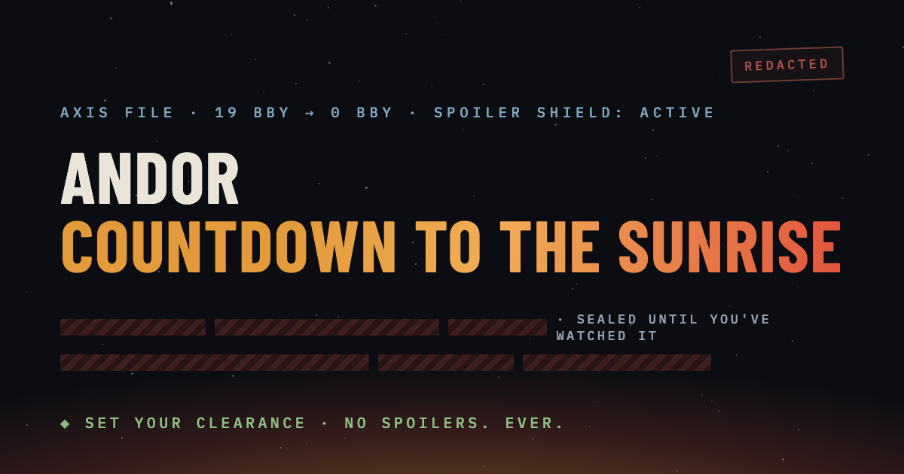

# Andor · Countdown to the Sunrise

An interactive, **spoiler-safe** archive of *Andor* — from the fall of the Republic through
Rogue One and the Battle of Yavin — with a built-in **spoiler shield**.

**Live site:** https://justrada.github.io/andor-timeline/



## How it works

Tell the archive the **last episode you finished** (S1E1 → S2E12) and which films you've seen
(Revenge of the Sith, Rogue One, A New Hope, Return of the Jedi). Everything beyond your
clearance renders as ISB-style redacted censor bars — and unseals, with ceremony, exactly as
far as you've watched. Sealed text never enters the page, so find-in-page and copy can't
reveal it either.

## What's inside

- **The timeline** — every era from 19 BBY to the sunrise, with expandable event files,
  per-era SITREPs, and production notes.
- **Surveillance Logs** — one bounded dossier per episode, plus a spoiler-free *field
  briefing* for whatever you're watching next.
- **Dossiers & Fates** — living character files that grow stage by stage; fates stay sealed
  until you've seen them land.
- **The Relay · Sector Chart · ISB Lexicon · Intercepted Transmissions · The Ledger** —
  the hand-off chain, a gated star chart, a jargon codex, a verbatim quotes archive, and a
  running tally of what the sunrise costs.
- **The Production Vault** — 28 fact-checked behind-the-scenes files, including Nemik's
  manifesto reassembling itself as you watch.
- **Field Assessment** — a quiz drawn *only* from what you've already seen; the pool grows
  with your clearance.
- **Second Pass Protocol** — a rewatch guide that unlocks only at full clearance.

## The loop

- **Remembers your progress** — stored in `localStorage`, this browser only; nothing is sent
  anywhere (fonts are self-hosted too).
- **New-intel tracking** — advancing an episode flags freshly unsealed files with green
  `NEW INTEL` markers; the shield button counts them and jumps between them. Every change
  has an **UNDO**.
- **One-tap advance** — a floating "✓ watched" pill and preset buttons ("Finished Season 1",
  "Seen it all") keep upkeep near zero, with a live *"+N files will declassify"* preview.
- **Share & sync** — share your clearance as spoiler-free text, carry it across devices with
  a sync link or export file, invite a friend at your exact clearance, or enter
  **shared-clearance view** to see only what's safe to discuss with them.
- **Arc stamps, a declassification meter, and a one-time sunrise finale at 100%.**
- Installable as a PWA and works offline.

## Development

A single static `index.html` — no build step, no dependencies.

```sh
python3 -m http.server 8437
# open http://localhost:8437
```

Spoiler gates use global episode numbering (S1E1=1 … S2E12=24) and live alongside the content
in the `<script id="data">` and `<script id="data2">` blocks. Episode attributions, quotes,
and BTS facts were verified against episode guides and published interviews, then
adversarially audited for leaks. Spotted an error, or have intel to add? Open an issue —
include the **spoiler gate** (the latest episode or film your fact touches).

## Disclaimer

Unofficial fan reference. Plot summary and analysis only. Not affiliated with Lucasfilm or
Disney. Code and original prose are MIT-licensed; see [LICENSE](LICENSE).
